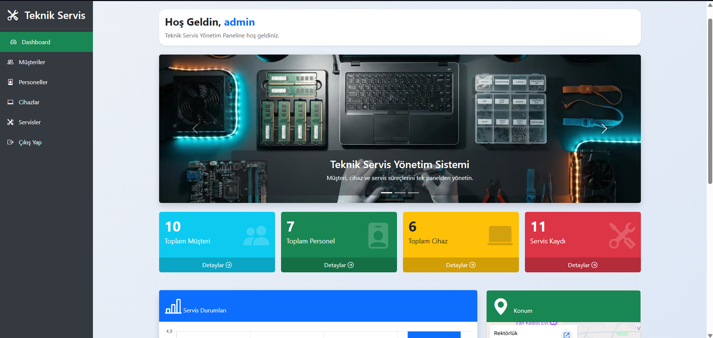
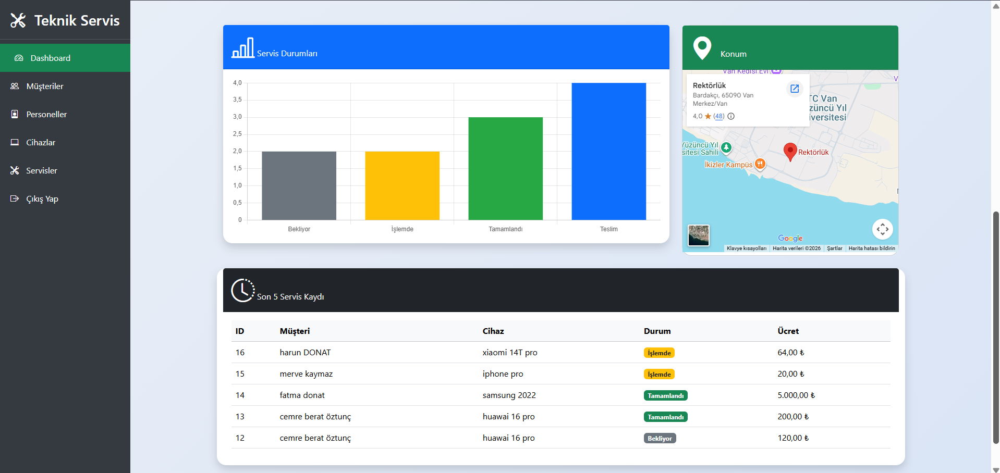
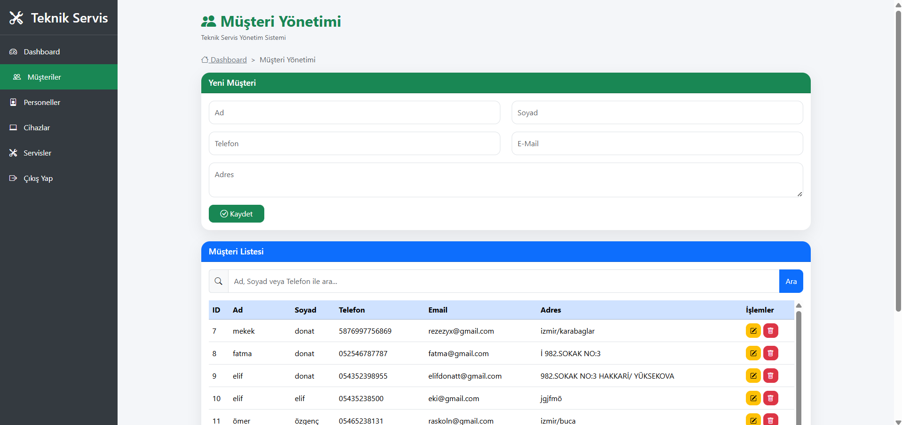
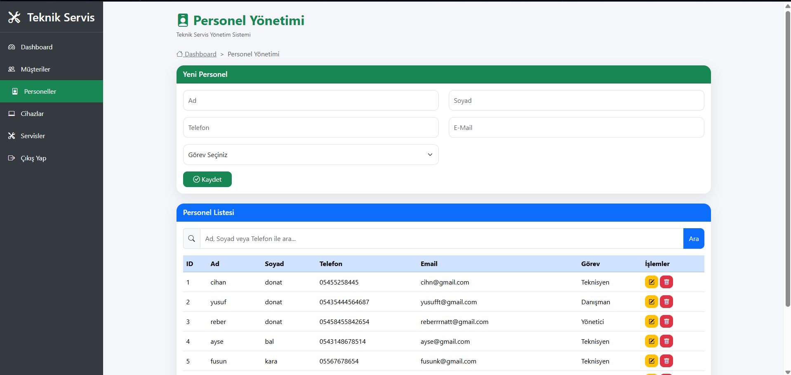
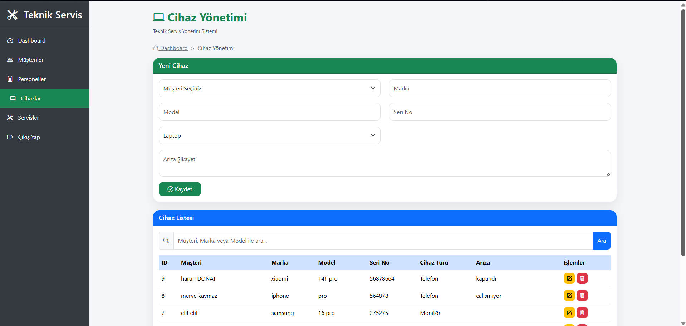
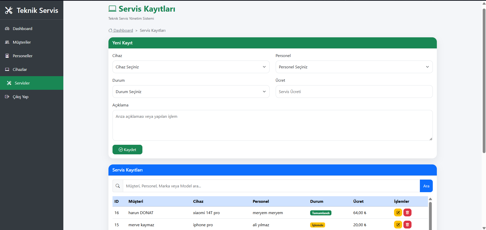

# Technical Service Management System

A web-based Technical Service Management System developed using **PHP**, **PostgreSQL** and **Bootstrap 5**.

---

## Features

-  User Login
-  Dashboard
-  Customer Management
-  Employee Management
-  Device Management
-  Service Management
-  Reports

---

## 🛠 Technologies

- PHP
- PostgreSQL
- Bootstrap 5
- HTML5
- CSS3
- JavaScript

---

## 📷 Screenshots

### Dashboard

---

### Customer Management

---

### Employee Management

---

### Device Management

---

### Service Management

---

## ⚙ Installation

1. Clone the repository.
2. Copy `db.example.php` as `db.php`.
3. Update your PostgreSQL connection information.
4. Create the database tables.
5. Run the project with Apache (WAMP).

---

## 👩‍💻 Developer

**Esra Donat**

Computer Engineering Student
